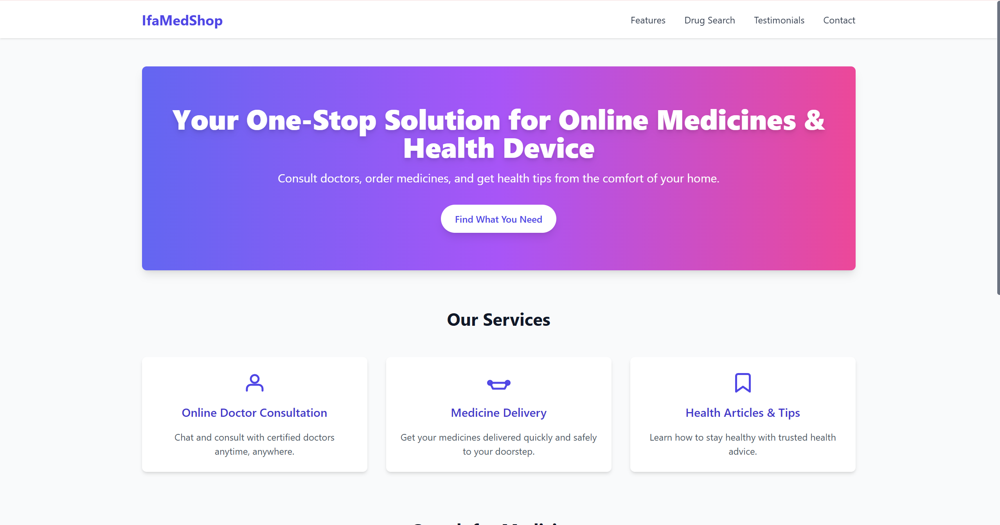

# Drugstore Website

This is a React.js based modern, interactive, and responsive drugstore website using Tailwind CSS.

## Features

- Responsive design for mobile, tablet, and desktop
- Interactive drug search simulation
- Sections highlighting services, testimonials, and health tips
- Tailwind CSS styling for modern UI

## Setup and Run

1. Make sure you have Node.js installed.
2. Run `npm install` to install dependencies.
3. Run `npm start` to start the development server.
4. Open `http://localhost:3000` in your browser.

## Notes

- This is a front-end only demo app without real backend data.
- The drug search feature is simulated with sample static data.

# IfaMedShop

IfaMedShop is a responsive single-page medical shop landing page developed as a frontend mini project. The website presents medical services, medicine search functionality, customer testimonials, and contact information through a simple and modern interface.

## Live Demo

[View Live Website](https://FakhiraIzza.github.io/ifamedshop-medical-store/)


## Preview



## Features

- Responsive single-page layout
- Medical service information
- Medicine search section
- Customer testimonials
- Navigation between page sections
- Modern gradient hero section
- Mobile-friendly interface

## Technologies Used

- React.js
- JavaScript
- Tailwind CSS
- HTML5
- CSS3
- Lucide React Icons

## Project Structure

```text
DRUGSTORE_ECOMMERCE/
├── public/
│   └── index.html
├── src/
│   ├── components/
│   │   ├── DrugSearch.js
│   │   ├── Features.js
│   │   ├── Footer.js
│   │   ├── Header.js
│   │   ├── Hero.js
│   │   └── Testimonials.js
│   ├── App.js
│   ├── index.css
│   └── index.js
├── package.json
├── tailwind.config.js
└── README.md

